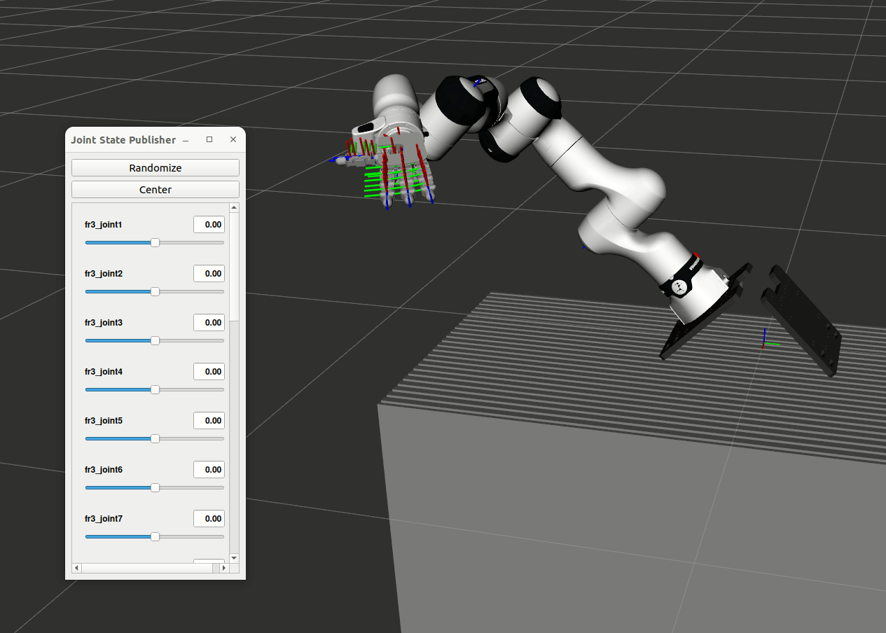

# Run Robot with ROS2
* **Contributor**: Chanyoung Ahn
- Turn on and connect PRIME / Robot computer
  - Check Network profile setting
    (ping -c 4 10.10.0.7)
- Publish robot ROS2 topic of Robot computer
  - Check Franka Control Repo README: [[Link]](https://github.com/KIST-PRIME-Lab/Franka_Dual_Arm_PtoP)
- Test on PRIME computer (IP: 10.10.0.8)

## Test ROS2 Topic Publish (REAL)
```shell
rs 
ros2 topic list

##### Results #####
# /franka/arm_state/left
# /franka/arm_state/right
# /franka/arm_target/left
# /franka/arm_target/right
# /hand/state/left
# /hand/state/right
# /hand/target/left
# /hand/target/right
# /parameter_events
# /rosout

```

## Quick Test
Franka Arm
```shell
    rs  # or rsi
    ros2 topic list

    # Safe Pose
    ros2 topic pub --once /franka/arm_target/right kistar_hand_ros2/msg/FrankaArmTarget "{joint_targets: [0.5, -0.6, 0.7, -2.4, -0.02, 1.2, 1.], arm_id: 0}"

    # See CY (Experimental)
    ros2 topic pub --once /franka/arm_target/right kistar_hand_ros2/msg/FrankaArmTarget "{joint_targets: [0.5, -0.6, 0.7, -2., -0.0, 3.2, -0.8], arm_id: 0}"


```


KISTAR Hand
```shell
    rs  # or rsi
    ros2 topic list

    ros2 topic pub --once /hand/target/right kistar_hand_ros2/msg/HandTarget "{joint_targets: [1000, 1000, 1000, 1000, 1000, 1000, 1000, 1000, 1000, 1000, 1000, 1000, 1000, 1000, 1000, 1000], movement_duration: 1.0, hand_id: 0}"

    # Funny Pose
    ros2 topic pub --once /hand/target/right kistar_hand_ros2/msg/HandTarget "{joint_targets: [4000, 0, 4000, 3000, 0, 4000, 4000, 3500, 0, 0, 1000, 1000, 0, 4000, 4000, 3500], movement_duration: 1.0, hand_id: 0}"

    # V Pose
    ros2 topic pub --once /hand/target/right kistar_hand_ros2/msg/HandTarget "{joint_targets: [4000, 0, 4000, 3000, -500, 0, 500, 500, 500, 0, 500, 500, 0, 4000, 4000, 3500], movement_duration: 1.0, hand_id: 0}"
```

KISTAR Hand Arrange:  
    Thumb [0:4]
    Index [4:8]
    Middle [8:12]
    Ring [12:16]


## Run Fake Robot in Rviz with joint controller

```shell
rs
ros2 launch franka_kistar_bringup fr3_kistar.launch.py

```
