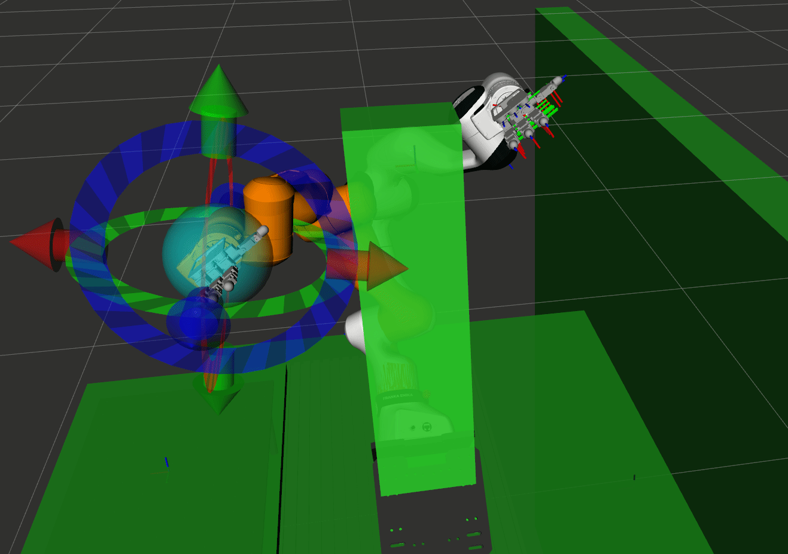
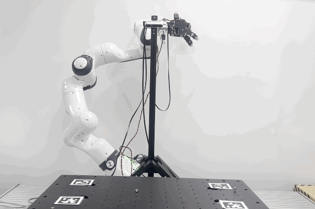

# Real Robot - MoveIt Example (Robot ↔ MoveIt)
<table>
  <tr>
    <td align="center">
      
    </td>
    <td align="center">
      
    </td>
  </tr>
</table>

```shell
rs

# Ongoing.. (previous)
ros2 launch franka_kistar_moveit_config moveit.launch.py bridge:=real arm_side:=right robot_ip:=10.10.0.7 use_fake_hardware:=false

# Updated Command (2025-01-30)
ros2 launch franka_kistar_bringup fr3_kistar_moveit_real.launch.py robot_ip:=172.16.0.1 use_rviz:=true 

# Run w/o real robot
ros2 launch franka_kistar_bringup fr3_kistar_moveit_real.launch.py use_fake_hardware:=true use_rviz:=true 
```

# Activate Realsense Camera
```shell
 ros2 launch realsense2_camera rs_launch.py pointcloud.enable:=true
```

## MoveIt w/ EE pose

### Test Fake Robot with single PC
```shell
# Terminal 1
rs
ros2 launch franka_kistar_bringup fr3_kistar_moveit_planning_pc.launch.py \
  use_fake_joint_states:=true

ros2 launch franka_kistar_bringup fr3_kistar_moveit_planning_pc.launch.py \
  use_fake_joint_states:=false

# Terminal 2
rs
ros2 run franka_kistar_bringup pose_commander.py \
  --ros-args \
  -p gui:=true \
  -p planning_group:=fr3_arm \
  -p end_effector_link:=fr3_link8 \
  -p planning_time:=5.0 \
  -p reference_frame:=fr3_link0

  # -p reference_frame:=world


0.307 0.0 0.487 0 1.0 0 0
# Check MoveIt planning with GUI 
```
### Test Real Robot with dual PC
```shell
export ROS_DOMAIN_ID=9
export ROS_LOCALHOST_ONLY=0

# PC2 with real robot + controller
ros2 launch franka_kistar_bringup robot_execution_pc.launch.py \
  robot_ip:=192.168.1.250

# PC1 
```

---

## Grasp_fruit 연계 실행 (Docker — `ros2_humble` 컨테이너)

Grasp_fruit 파이프라인(`run_pipeline_interactive.py`)은 Stage 3(로봇 실행)에서  
`ros2_humble` Docker 컨테이너 안으로 `docker exec`를 날린다.  
파이프라인을 돌리기 전에 아래 순서로 MoveIt2를 띄워 두어야 한다.

### 1. X11 포워딩 허용

```bash
xhost +local:docker
```

### 2. 컨테이너 시작

```bash
docker start ros2_humble
```

### 3. MoveIt2 런치 (`fr3_interactive_pose_control.launch_GWB.py`)

```bash
docker exec -it -e DISPLAY=$DISPLAY ros2_humble bash -c "
  unset PYTHONPATH PYTHONHOME CONDA_PREFIX CONDA_DEFAULT_ENV CONDA_PROMPT_MODIFIER
  export PATH=/usr/sbin:/usr/bin:/sbin:/bin:/opt/ros/humble/bin
  export ROS_DOMAIN_ID=9
  export RMW_IMPLEMENTATION=rmw_fastrtps_cpp
  export ROS_LOCALHOST_ONLY=0
  source /opt/ros/humble/setup.bash
  source /root/HARILAB/dex_ros/isaac-ros/kistar_ws/install/setup.bash
  ros2 launch franka_kistar_bringup fr3_interactive_pose_control.launch_GWB.py \
    gui:=true \
    use_fake_joint_states:=false \
    execute_mode:=direct_franka_topic \
    reference_frame:=base
"
```

**런치 파라미터 설명:**

| 파라미터 | 값 | 설명 |
|---|---|---|
| `gui` | `true` | RViz 활성화 |
| `use_fake_joint_states` | `false` | 실제 로봇 joint states 사용 |
| `execute_mode` | `direct_franka_topic` | Franka topic으로 직접 전송 |
| `reference_frame` | `base` | MoveIt planning 기준 프레임 |

> `unset PYTHONPATH ...` 라인은 호스트의 Conda 환경이 컨테이너 안으로 새어 들어오는 것을 막는다.  
> 생략하면 컨테이너 내 Python/ROS2 패키지가 오염되어 import 오류가 날 수 있다.

### 4. 준비 완료 확인

아래 액션 서버가 활성화되면 Grasp_fruit Stage 3이 동작 가능하다.

```bash
# 호스트에서 확인
ROS_DOMAIN_ID=9 ros2 action list
# /move_action  ← 이게 보여야 함
```

### 주의사항

- 이전 세션 종료 후 컨테이너를 재시작하지 않으면 MoveGroup 노드가 두 개 뜰 수 있다.  
  `[WARN] Ignoring unexpected result response` 경고가 보이면:

  ```bash
  docker restart ros2_humble
  # 이후 다시 docker exec로 런치
  ```

- 런치 파일 위치:
  ```
  isaac-ros/kistar_ws/src/franka_kistar_bringup/launch/
      fr3_interactive_pose_control.launch_GWB.py
  ```

---

## Troubleshooting
```shell
ros2 pkg executables franka_kistar_isaac_moveit

# Rebuild
colcon build --symlink-install
bash install/local_setup.sh
```
