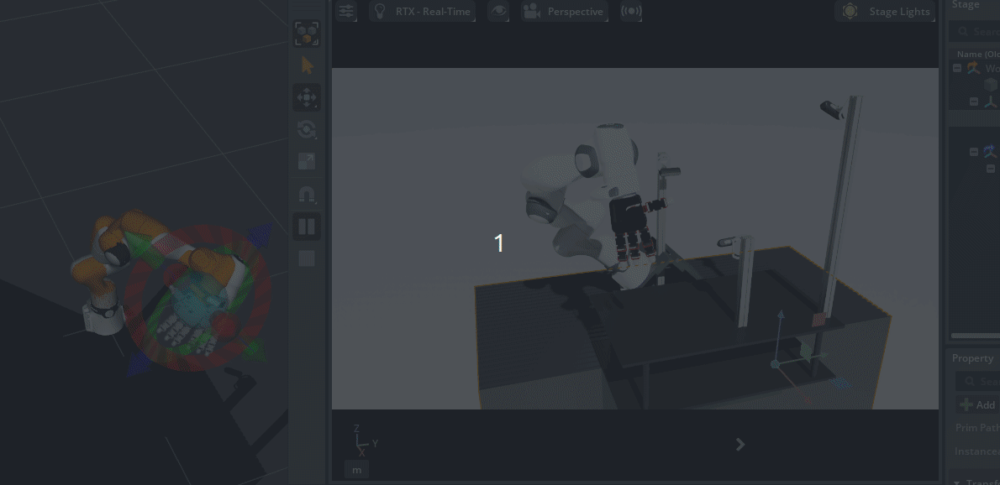

# Isaac Sim ROS & ROS2 Workspaces

This repository contains two workspaces: `humble_ws` (ROS2 Humble) and `jazzy_ws` (ROS2 Jazzy). 

[Click here for usage and installation instructions with Isaac Sim](https://docs.isaacsim.omniverse.nvidia.com/5.0.0/index.html)

When cloning this repository, both workspaces are downloaded. Depending on which ROS distro you are using, follow the [setup instructions](https://docs.isaacsim.omniverse.nvidia.com/5.0.0/installation/install_ros.html#setting-up-workspaces) for building your specific workspace.


## Installation 


1. Build Docker image
```shell
cd ~/isaac-ros
./build_ros.sh -d humble -v 22.04
```

2. when you want to activate ROS2 Python 3.11, input these commands each terminal.


```shell
source build_ws/humble/humble_ws/install/local_setup.bash
source build_ws/humble/isaac_sim_ros_ws/install/local_setup.bash
```

### Recommand 
- Just input this commands in your bash 
  ```shell

  dex() {
      cd "$HOME/isaacsim/isaacsim-5.1.0" || return
      conda activate dexsdr
      export isaac_sim_package_path=$HOME/isaacsim/isaacsim-5.1.0
      # 1) 기존 ROS 흔적 싹 지우기
      unset ROS_VERSION ROS_PYTHON_VERSION
      unset ROS_PACKAGE_PATH
      clean_var() {
        local name="$1"
        local val="${!name}"
        if [ -n "$val" ]; then
          export "$name"="$(echo "$val" | tr ':' '\n' | grep -v '/opt/ros/humble' | paste -sd: -)"
        fi
      }
      clean_var PYTHONPATH
      clean_var LD_LIBRARY_PATH
      clean_var PATH
      export ROS_DISTRO=humble
      export RMW_IMPLEMENTATION=rmw_fastrtps_cpp
      export ROS_DOMAIN_ID=9
      export ROS_LOCALHOST_ONLY=0
      export LD_LIBRARY_PATH="$isaac_sim_package_path/exts/isaacsim.ros2.bridge/humble/lib:$LD_LIBRARY_PATH"

      export ROS_DISTRO=humble
      export RMW_IMPLEMENTATION=rmw_fastrtps_cpp
      export LD_LIBRARY_PATH=$PWD/exts/isaacsim.ros2.bridge/humble/lib:$LD_LIBRARY_PATH

  }

  # Ros2 Isaac Sim Python 3.10
  rs(){
    conda activate ros
    source /opt/ros/humble/setup.bash
    source ~/fr_ws/install/setup.bash
    source ~/isaac_ws/dex_soldering/dex_ros/isaac-ros/humble_ws/install/setup.bash
    source ~/isaac_ws/dex_soldering/dex_ros/isaac-ros/kistar_ws/install/setup.bash
    export RMW_IMPLEMENTATION=rmw_fastrtps_cpp
    export ROS_DOMAIN_ID=9                  
    export ROS_LOCALHOST_ONLY=0     
  }

  # Ros2 Isaac Sim Python 3.11
  rsi(){
    source /opt/ros/humble/setup.bash
    export RMW_IMPLEMENTATION=rmw_fastrtps_cpp
    export ROS_DOMAIN_ID=9                    
    export ROS_LOCALHOST_ONLY=0     
    cd "$HOME/isaac_ws/dex_soldering/dex_ros/isaac-ros/humble_ws" || return
    source install/setup.bash

  }
    
  ```

## Just use ROS2 Humble with Python 3.10
```shell
cd ~/isaac-ros/humble_ws
git submodule update --init --recursive # If using docker, perform this step outside the container and relaunch the container
rosdep install -i --from-path src --rosdistro humble -y
colcon build

# for developer
colcon build --symlink-install --cmake-args -DCMAKE_BUILD_TYPE=RelWithDebInfo

# for inference
colcon build --symlink-install --cmake-args -DCMAKE_BUILD_TYPE=Release


# 1) 항상 ROS 기본
source /opt/ros/humble/setup.bash

# 2) Franka 패키지 (underlay)
source ~/fr_ws/install/setup.bash

# 3) Isaac 예제 + 네 코드 (overlay)
source ~/isaac_ws/dex_soldering/dex_ros/isaac-ros/humble_ws/install/setup.bash
source ~/isaac_ws/dex_soldering/dex_ros/isaac-ros/kistar_ws/install/setup.bash

# Build overlay
source install/setup.bash
```

## Example
```shell
ros2 run joint_state_publisher_gui joint_state_publisher_gui /tmp/fr3_kistar.urdf

```

## MoveIt! Example 

```shell
rs 

# 터미널 1 – Learn dummy robot
ros2 launch franka_kistar_isaac_moveit_config moveit.launch.py   robot_ip:=dummy   use_fake_hardware:=true   launch_rviz:=true


# 터미널 2 – MoveIt + RViz (kistar URDF)
ros2 launch franka_kistar_moveit_config moveit.launch.py

```

